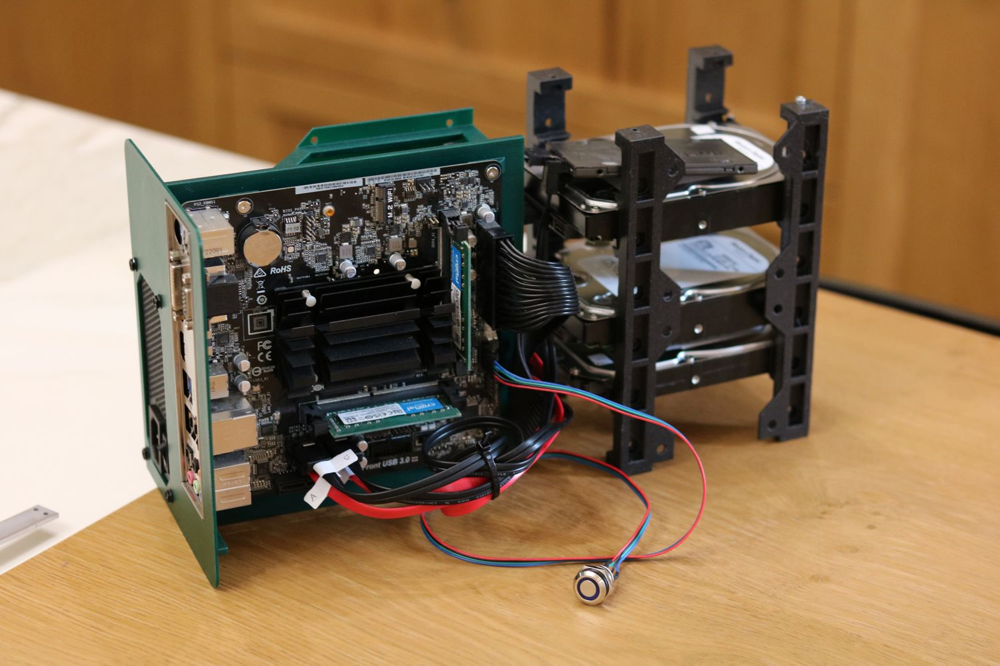

# Umbreon Mini Itx

A 3D printed Mini Itx case with 6 3.5'' HDD bays in a compact form factor (210x170x380 mm in LxWxH)

### To Do

The case is almost complete, here are some small things that will have to be checked before completion

- [x] all magnet sizes are correct (12.2 x 5.2 x 2.2)
- [x] all magnets are aligned correctly
- [x] all screw holes are aligned correctly
- [x] all threaded-instert holes are 4.6mm in diameter
- [x] all threaded-inserts in the top and bottom panels have remaining width of 1.5mm
- [x] all pass-through holes for screws are 3.5mm
- [x] all holes for screw head are 4mm deep and >= 6mm diameter
- [x] all columns are printable without support
